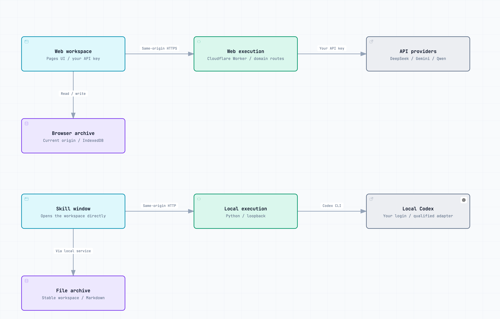
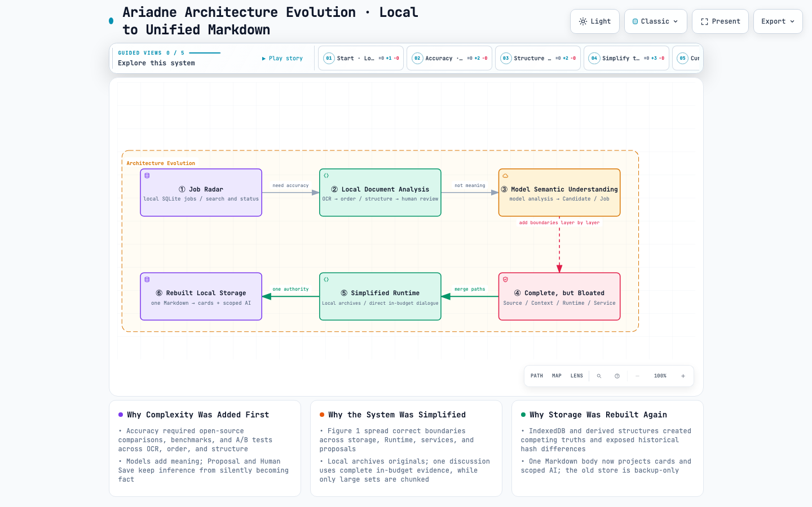
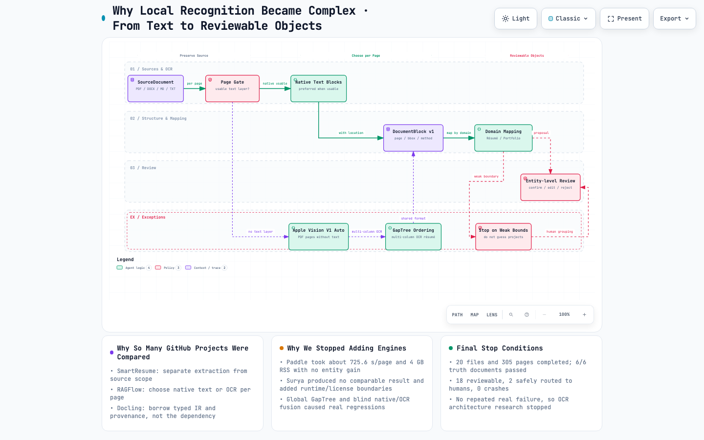
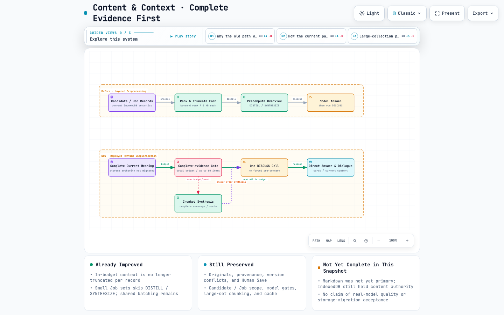

# Ariadne · 衡

2026-09-20: Ariadne has two product paths: Web (your API, browser storage) and Skill (local Codex, local files). The Skill opens the workspace directly. The website’s local Agent entry provides installation guidance; website pairing is retired. See [current architecture](docs/current/TWO_PRODUCT_ARCHITECTURE.md).


> **Understand your experience. Make sense of your next role.**
>
> An open-source AI workspace for exploring your experience and target jobs, with original sources, reviewable suggestions, and changes you explicitly save.

[中文说明](README.zh-CN.md) · [Architecture evolution](docs/architecture/archify/2026-09-12-project-evolution/07-architecture-evolution-six-stages.en.html) · [Project history](PROJECT_HISTORY.md) · [Runtime contract](docs/current/ARIADNE_RUNTIME_EXECUTION_CONTRACT.md) · [Skill guide](docs/current/ARIADNE_SKILL.md)

[Try the web app](https://ariadne.kai-nex.com/) · [Skill setup](docs/current/ARIADNE_SKILL.md)

[](https://ariadne.kai-nex.com/)

## Product case & ownership

**An independent project by [KAI](https://github.com/KAI-NEX), built with AI-assisted development.** I own the product definition, architecture decisions, interaction design, implementation process, validation, and release. Independent ownership describes how I delivered the project; it does not mean every line was written without AI tools.

The product question is whether people can understand the relationship between their experience and a target role without losing the distinction between source facts, model suggestions, and their own decisions. My main design choices are separate Candidate/Job contexts, reviewable proposals, and explicit human save.

**Delivered:** a web app and macOS preview, source-preserving workflows, model integration, and documented failure/iteration cases. **Next to validate:** whether independent target users complete career-evidence tasks more accurately or with less effort than their existing workflow. Internal tests and a public release are not evidence of adoption or hiring outcomes.

[Read the product case / 产品案例与个人贡献](docs/product/PRODUCT_CASE_STUDY.md) · [User-validation protocol / 用户验证方案](docs/product/USER_VALIDATION_PLAN.md)

## What you can do

Ariadne helps you understand your experience in relation to a job you care about. Add your résumé, portfolio, or project notes, then add the job description separately. With a connected model, you can discuss which requirements your materials support, what needs more evidence or clarification, and how to describe your work more clearly.

You can keep the original documents, review suggestions, and save the changes you agree with as new versions. The model does not decide your career goal or automatically submit applications.

## Your first session

1. **Choose an entry.** Use your API key on the website, or select **暂不连接 AI** to archive originals first. For local Codex, install the Skill and invoke it to open the workspace directly.
2. **Add your materials.** Open **个人资料** (Personal materials), import a résumé, portfolio, or project document, and retain the source. For AI analysis, confirm the transmission shown by the app; Web uses a verified API model and Skill uses local Codex.
3. **Review the understanding.** Check the proposed content against your original material. Correct or reject unsupported statements, then explicitly save what you accept.
4. **Add a target role.** Open **职位描述** (Job descriptions), import the role’s requirements, and review them separately from your personal material.
5. **Discuss that role.** Open its details and ask: “Which requirements are supported by my materials? Where do I need more evidence or a clearer explanation?” Review the answer and decide what to do next. Discussion alone does not update confirmed data.

No model connection yet? You can still archive original materials in Local mode and return to analyze them later. Model output requires review; a missing piece of evidence does not prove a missing ability.

## Try Ariadne

[Open the web app](https://ariadne.kai-nex.com/) · [Install Ariadne Skill](https://ariadne.kai-nex.com/#skill)

### Web + Ariadne Skill (preferred direction)

On Mac, the Skill opens a standalone window. Closing its last window stops its service and keeps saved data. First use requires macOS 14+ and Apple Command Line Tools to compile the small window host for this Mac; it does not use Codex’s in-app browser.

Open “Use through a local Agent” on the website, click “Copy installation instructions,” paste them into Codex, and wait for installation and dependency checks. Then send `$ariadne 打开 Ariadne` to open the workspace directly. The Skill uses local Codex; the website uses API keys. They do not pair with each other or automatically synchronize data. Source tracking and explicit human save remain in place.

[Setup and build guide](docs/current/ARIADNE_SKILL.md) · [Skill source](skills/ariadne/SKILL.md). Pages builds include the complete Skill ZIP. Local acceptance is complete; the [installation dialog](https://ariadne.kai-nex.com/#skill) provides a prompt to install the complete package from GitHub Releases. Python 3.9+, a compatible Codex CLI and Poppler are required. Other Agents and OS environments require their own verification.

Historical Mac App builds and data notes remain in the [local distribution record](docs/current/LOCAL_DISTRIBUTION.md). The current local entry point is the Skill.

## Current architecture

Web and Skill share Candidate/Job pages, source tracking, versions and explicit human save, while keeping startup, model execution and storage separate. Web uses your API key and browser storage. Skill uses local Codex and a stable file workspace in its own window. The website’s local Agent entry only explains installation; it does not connect to local ports.

[](docs/architecture/archify/2026-09-20-web-skill/ariadne-en.png)

[English interactive diagram](docs/architecture/archify/2026-09-20-web-skill/ariadne-en.html) · [中文架构图](docs/architecture/archify/2026-09-20-web-skill/ariadne-zh.html) · [Editable source](docs/architecture/archify/2026-09-20-web-skill/ariadne-en.architecture.json) · [Validation record](docs/architecture/archify/2026-09-20-web-skill/review.json) · [Implementation boundaries](docs/current/TWO_PRODUCT_ARCHITECTURE.md). Download the HTML and open it locally for zoom, source evidence, themes and export; GitHub displays HTML as source. The earlier [Web/Mac App diagram](docs/architecture/archify/2026-09-19-current/ariadne.html) remains a historical snapshot.

## Why move from a web UI to an installer, then a Skill?

I first focused on how materials could be understood and saved reliably, then on making that workflow easier to access. Each delivery change preserved the document interface and human-save rules.

| Stage | Why I chose it | Cost and subsequent decision |
| --- | --- | --- |
| Early local web UI | A browser interface and local service let me validate imports, separate Candidate/Job contexts, review, saving and model conversations, with inspectable sources and state. | It depended on the project environment and a running service. Being runnable by its developer did not make it easy to install elsewhere. A public web version was later retained for API use without local installation. |
| Standalone package / Mac App | Bundling the UI, backend, Python, Codex and PDF tools provided a dedicated window and service shutdown when the last window closed, without requiring a terminal or developer environment. | Bundled runtimes, platform compatibility and distribution needed maintenance. Web use, local APIs and Codex also crowded the same entry flow. |
| Web + local Skill | Codex was already my local entry point. I wanted to install, check dependencies and launch Ariadne from that conversation while keeping the full document and review interface. Web now focuses on APIs; Skill focuses on the local Agent and opens the workspace directly. | The Skill bundle is smaller, but depends on local Python, Codex, PDF tools and the window build environment. Data does not synchronize automatically. Only Codex has been verified; another Agent still needs an adapter, capability checks and compatible save boundaries. |

The Skill is an installation and invocation entry with complete runtime code. Materials belong to an independent local workspace, not to a particular Agent conversation; ordinary discussion cannot silently change confirmed records. A future Agent can reuse the same file store only with a verified workspace identity and compatible execution and write contracts. Cross-product synchronization and feedback-update features are not implemented in this change.

Evidence: [installer history](docs/current/LOCAL_DISTRIBUTION.md), [Skill and data boundaries](docs/current/ARIADNE_SKILL.md), and [stage validation records](PROJECT_STATUS.md). These are implementation and delivery decisions, not evidence that independent users save time or achieve better hiring outcomes.

## Why Ariadne

Most AI career tools optimize text. Ariadne is built to protect judgment.

Personal experience is not ordinary input data: a fluent rewrite can be unsupported, a job requirement can be mistaken for a personal fact, and a plausible answer can hide what remains unknown. Ariadne therefore keeps five things distinct:

1. **Source material** — what the supplied document actually says.
2. **User-confirmed information** — what the person has explicitly accepted as their own.
3. **Model inference** — an interpretation or suggestion, never automatic truth.
4. **Working proposals** — reviewable changes that have not yet become confirmed data.
5. **Unknowns** — gaps that need clarification, not invented evidence.

Candidate material and job descriptions are separate domains with their own versions and permissions. Ariadne relates the current valid versions only when the user chooses a job to discuss. Its useful output is not a black-box match score: it explains what has support, what needs evidence, what needs clearer expression, and what cannot yet be concluded.

## Why not just use Codex?

Codex is excellent at general software work: it can inspect a workspace, use tools, edit files, and verify a result. Ariadne solves a different problem. It is a product-level boundary around sensitive career material.

| | Codex | Ariadne |
| --- | --- | --- |
| Primary context | Codebase, tools, and a task | Candidate sources, job sources, versions, and consent |
| Success condition | A software task is completed and checked | A career judgment is traceable and reviewable |
| Authority to change | Can edit project files within the requested task | Can only create a proposal; the person explicitly saves a confirmed version |
| Treatment of uncertainty | Resolve the task with available evidence | Preserve unknowns rather than turn them into claims |
| Scope | General-purpose agent runtime | Domain runtime for career judgment |

Codex can be an Ariadne model provider, but it is deliberately not given open workspace-agent authority over a person's career data. Ariadne limits each request by domain, operation, source, version, runtime capability, and save permission. A failed Model request fails visibly; it never pretends to have succeeded or silently becomes a Local result.

## How Ariadne differs from related projects

These are complementary projects, not inferior versions of Ariadne. Choose the tool whose boundary matches the problem.

| Project | Best for | Different from Ariadne |
| --- | --- | --- |
| [Reactive Resume](https://github.com/AmruthPillai/Reactive-Resume) | Building, customizing, exporting, and self-hosting résumés | A résumé builder. Ariadne focuses on the source, inference, review, and versioning lifecycle before a résumé is produced. |
| [OpenResume](https://github.com/xitanggg/open-resume) | Browser-local résumé creation and ATS-oriented PDF parsing | A lightweight local résumé tool. Ariadne keeps a separate Job domain and makes model proposals reviewable rather than treating parsed data as a complete career judgment. |
| [AI Job Search](https://github.com/MadsLorentzen/ai-job-search) | An agent-driven, forkable workflow for evaluating roles, tailoring CVs, letters, interviews, and job portals | A full job-application framework. Ariadne deliberately stops before automatic application execution and treats personal truth, source provenance, and human save as the core product. |
| [jobsearch-mcp](https://github.com/TadMSTR/jobsearch-mcp) | Self-hosted multi-board search, semantic fit scoring, tracking, and alerts through MCP | An MCP service for an end-to-end job-search pipeline. Ariadne is the evidence-aware reasoning workspace that resists score-as-truth and keeps external execution outside its core. |

### Recommendations

- Choose **Reactive Resume** or **OpenResume** when the immediate goal is designing and exporting a résumé.
- Choose **AI Job Search** when you want a forkable agent workflow that actively searches, tailors, and helps execute applications.
- Choose **jobsearch-mcp** when you want a self-hosted MCP backend for job discovery, tracking, and alerts.
- Choose **Ariadne** when the question comes first: *what can I truthfully say about my experience, what does this job actually require, what supports the relationship, and what should remain unknown until I clarify it?*

Ariadne can sit before any of these workflows: it prepares a reviewed, source-grounded understanding that a résumé builder, search system, or human can use without mistaking model inference for personal fact.

## What works today

- Import Candidate and Job materials from PDF, DOCX, images, text, and Markdown; retain the original source and restore it later.
- Archive original materials in Local mode with zero provider calls; analyze them later with a Model runtime that has passed the image and visual-PDF capability gate.
- Review model output as Working content and explicitly save it as a new confirmed version.
- Discuss Candidate material, a specific Job, personal understanding, or an overview of all current jobs—each with its own context and write boundary.
- Make bounded natural-language edits to existing, same-source Candidate cards; Ariadne validates identity, versions, allowed fields, and actual execution before showing a receipt.
- Attach materials to a conversation turn with an explicit transmission confirmation. Attachments stay separate from confirmed Candidate and Job data.
- Use local Codex through the Skill. The website’s local Agent entry explains installation and invocation; it does not connect to the local machine.

The verified Codex combination is `codex-cli 0.153.4` with `gpt-5.6-sol`. The Skill service runs on loopback and preserves Ariadne’s domain and save boundaries. Current setup is in the [Skill guide](docs/current/ARIADNE_SKILL.md); the [connector guide](docs/current/CODEX_RUNTIME_CONNECTOR.md) records the retired pairing design.

Content now uses a [shared Markdown repository](docs/current/MARKDOWN_CONTENT_STORAGE.md): real files for the local app, the same document format in browser storage for the web app. Cards are views of those documents; original files, review states, and history remain separate and traceable. Existing browser data migrates on first access, with the old database retained as a backup.

## What Ariadne deliberately does not do

- Does not auto-submit applications or operate a job board on the user's behalf.
- Does not treat a match score as a career verdict.
- Does not invent achievements, skills, preferences, or job requirements.
- Does not merge Candidate and Job facts into one mutable profile.
- Does not silently downgrade a Model request to Local processing.
- Does not include the maintainer's credentials, résumé, job data, database, or browser workspace in this repository.

## The idea in one flow

```text
original material
    → durable source + provenance
    → optional qualified Model understanding
    → Working proposal / explanation / clarification
    → human review
    → explicit save
    → versioned confirmed context
    → selected Job relationship analysis
```

The model is allowed to interpret. The person remains the authority on what becomes their story.

## From Job Radar to Ariadne

The project began as **Job Radar**, a local job-record tool. It became Ariadne through a sequence of corrections: each architecture solved a real problem, then exposed the next one. The direction changed from “store and structure job-search material” to “help a person form useful, source-grounded career judgment.”

[](docs/architecture/archify/2026-09-12-project-evolution/07-architecture-evolution-six-stages.en.html)

### 1. Local Job Radar

The first architecture was intentionally narrow: local SQLite job records, search, status, and manual review. It worked because the input and authority model were simple; it did not yet need to understand a person's documents.

### 2. Local document analysis for accuracy

Real PDFs, screenshots, résumés, and portfolios made plain text extraction insufficient. The project compared open-source approaches, ran benchmarks and A/B tests, and separated OCR accuracy from reading order, document structure, domain mapping, and human review. Local processing protected privacy and produced inspectable evidence, but the implementation grew because “reading every character” is not the same problem as “understanding the document.”

[](docs/architecture/archify/2026-09-12-project-evolution/02-document-understanding.en.html)

### 3. Model-based semantic understanding

The next correction was conceptual: locally structured blocks and fields still did not explain what an experience meant, what a job actually required, or how the two related. Ariadne introduced qualified multimodal models and separate Candidate and Job domains. Model output became a reviewable explanation or **Working/Proposal**, while **Human Save** remained the only way to create a confirmed version.

### 4. Correct boundaries, increasingly complex system

Source integrity, domain isolation, context scope, runtime capability checks, transmission consent, provider execution, proposal review, and revision history were all necessary. Accumulated independently, however, they produced the large multi-layer architecture shown in the earlier system diagram: a request could cross storage, browser context, runtime gates, domain services, external inference, proposal handling, and persistence before it became useful.

### 5. Simplify the path without removing the protections

The system then stopped using local OCR or rule-based structure as if it were semantic understanding. Local mode returned to zero-provider original-file archiving; Model mode performs the interpretation. Within budget, current material goes directly into one discussion call instead of mandatory DISTILL/SYNTHESIZE stages. Only genuinely over-budget large collections use complete chunked synthesis and caching. Source identity, Candidate/Job separation, capability gates, proposals, and Human Save remain.

[](docs/architecture/archify/2026-09-12-project-evolution/05-content-context-simplification.en.html)

### 6. Rebuild local storage around one content authority

The simplified runtime exposed a remaining problem in the original local storage design: IndexedDB records, derived structures, cards, and source envelopes could behave like several competing truths. Migration also revealed historical hash-format differences. The current architecture stores one canonical Markdown content body per record/version—real files in the local app and the same document format in browser storage. Cards and scoped model context are projections of that body; originals, review state, and history remain separate. The old database is retained as a backup and is not double-written.

The result is deliberately smaller, not boundary-free: **one content body, several controlled views, and one explicit confirmation boundary**. Read the [interactive Archify diagram](docs/architecture/archify/2026-09-12-project-evolution/07-architecture-evolution-six-stages.en.html), the [full project history](PROJECT_HISTORY.md), and the [Markdown storage contract](docs/current/MARKDOWN_CONTENT_STORAGE.md) for evidence and implementation details.

## Run from source (developers)

Requirements:

- Python 3.11+
- Node.js 20+ for the regression suite
- macOS for the currently verified complete document path; some local PDF/OCR processing uses Swift, PDFKit, and Vision
- Poppler's `pdftoppm` for complete PDF-to-image rendering

```sh
git clone https://github.com/KAI-NEX/Ariadne.git
cd Ariadne
python3 app.py
```

Open [http://127.0.0.1:8000/](http://127.0.0.1:8000/). A clean clone starts with an empty local workspace and does not require the maintainer's private seed data.

To enable the local Codex runtime, first install and log in to Codex CLI, confirm `codex login status`, then run:

```sh
ARIADNE_CODEX_ENABLED=1 python3 app.py
```

The service is intentionally loopback-only. Do not expose it or the connector through a public tunnel, reverse proxy, or router mapping.

## Verification

```sh
python3 scripts/run_regressions.py
python3 scripts/check_vi.py
python3 scripts/check_public_release.py
```

| Directory | Purpose |
| --- | --- |
| `public/` | Native HTML, CSS, JavaScript, and visual assets |
| `src/` | Domain contracts, document handling, and provider adapters |
| `data/` | Public schemas, contracts, and synthetic examples |
| `tests/` | Synthetic regression coverage; private real-material fixtures are not published |
| `docs/` | Current contracts and retained design evidence |

## Project status and contribution

Ariadne is an early open-source preview with a [hosted web app](https://ariadne.kai-nex.com/) and a Codex Skill that opens a standalone Mac window. Model output must be reviewed; passing tests does not guarantee correct interpretation of every real document. Full document-path verification currently focuses on macOS.

See [CONTRIBUTING.md](CONTRIBUTING.md), [SECURITY.md](SECURITY.md), [CHANGELOG.md](CHANGELOG.md), and the [MIT License](LICENSE). For current implementation status, read [PROJECT_STATUS.md](PROJECT_STATUS.md); for stable product constraints, read [PROJECT_CONTEXT.md](PROJECT_CONTEXT.md).
