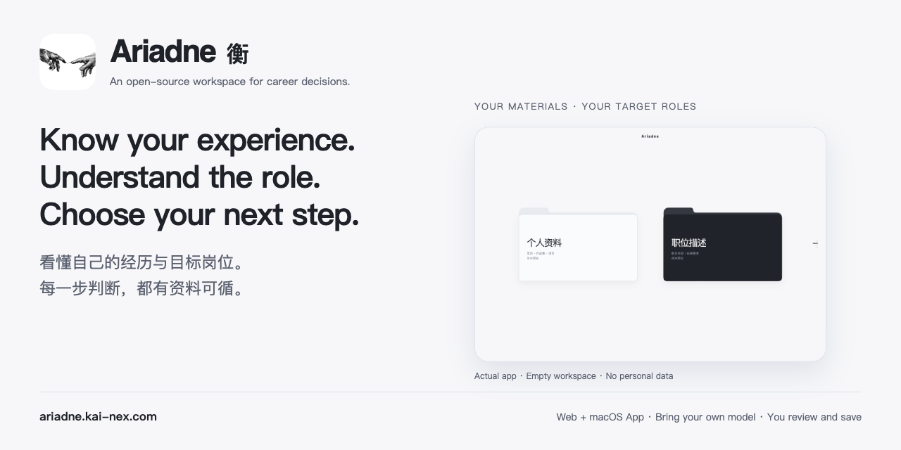
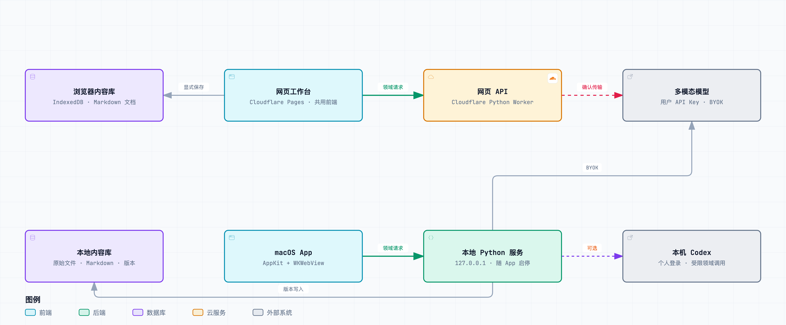
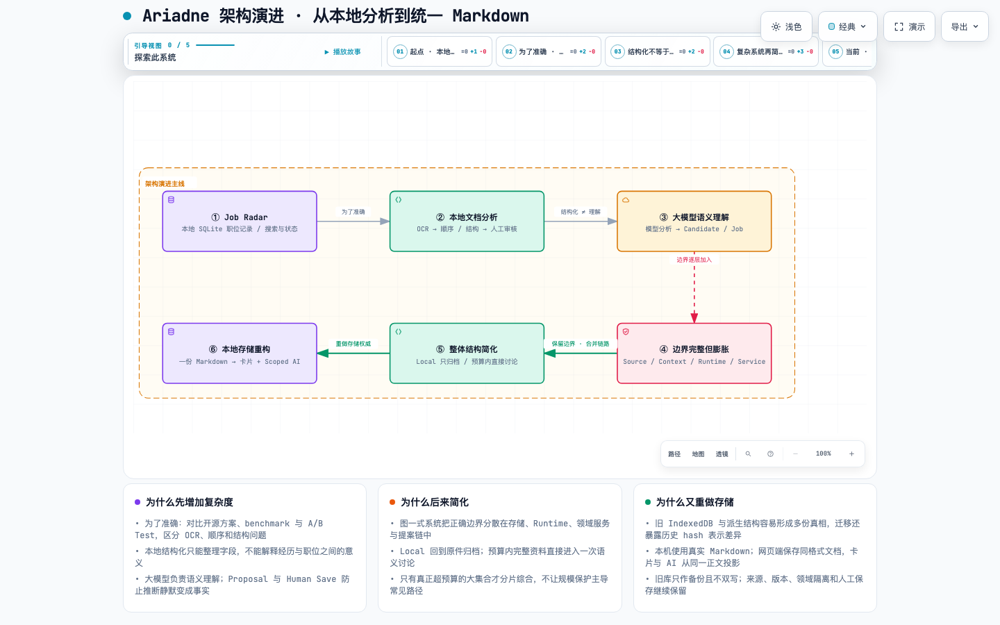
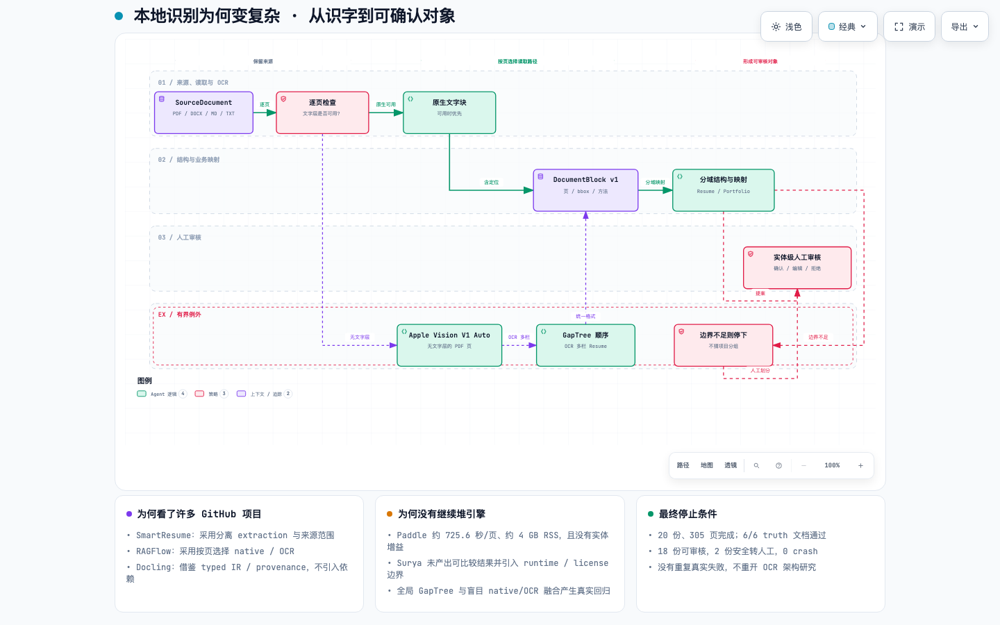
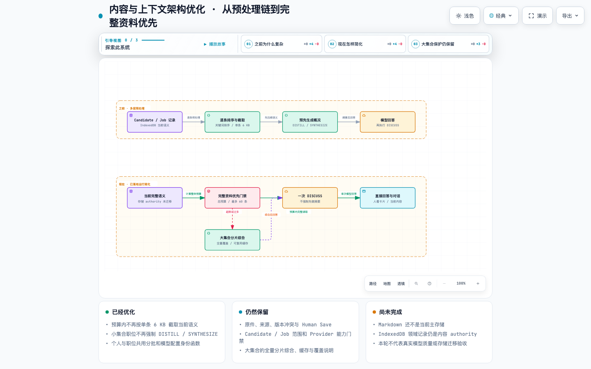

# Ariadne · 衡

2026-09-20：Ariadne 分为网页版（自带 API、浏览器资料库）与本地 Skill（Codex、本地文件库）。Skill 直接进入工作空间，不再经过模型选择页；网页的本地 Agent 入口只提供安装说明。旧网页配对停止使用。参见 [当前双端架构](docs/current/TWO_PRODUCT_ARCHITECTURE.md)。


> **看懂自己的经历，理解想去的岗位。**
>
> 一个开源 AI 工作空间：结合你的资料与目标职位讨论已有支持、未知和下一步，保留原件，由你审阅并保存变化。

[English README](README.md) · [架构演进图](docs/architecture/archify/2026-09-12-project-evolution/07-architecture-evolution-six-stages.html) · [完整项目经历](PROJECT_HISTORY.md) · [运行时契约](docs/current/ARIADNE_RUNTIME_EXECUTION_CONTRACT.md) · [Codex 连接器](docs/current/CODEX_RUNTIME_CONNECTOR.md)

[打开网页版](https://ariadne.kai-nex.com/) · [Skill 安装说明](docs/current/ARIADNE_SKILL.md)

[](https://ariadne.kai-nex.com/)

## 产品案例与个人贡献

**由 [KAI](https://github.com/KAI-NEX) 独立完成的项目，使用 AI 工具辅助开发。** 我负责产品定义、架构取舍、交互设计、实现推进、验证与发布。这里的独立完成指项目整体由我负责，不代表每一行代码都未经 AI 辅助。

核心问题：怎样帮助求职者理解经历与岗位的关系，同时分清原文事实、模型建议和个人决定？我的主要设计取舍是个人资料与岗位分域、模型修改先形成待审阅提案、用户明确保存后才更新确认版本。

**已经交付：** 网页和 macOS 预览版、保留原件的工作流、模型接入，以及可追溯的失败与迭代记录。**下一步验证：** 独立目标用户是否比原有工作方式更准确、更省力地完成职业证据判断。内部测试和公开发布不等于用户采用或求职效果。

[阅读产品案例与个人贡献](docs/product/PRODUCT_CASE_STUDY.md) · [查看真实用户验证方案](docs/product/USER_VALIDATION_PLAN.md)

## 可以用它做什么

Ariadne 帮你结合自己的经历，理解一个真正关心的岗位。你可以加入简历、作品集或项目记录，再单独加入职位描述。连接模型后，围绕这个职位讨论：哪些要求已有资料支持，哪些还需要补充证据或澄清，以及怎样更清楚地表达做过的事。

原始材料会保留；模型提出的内容先供你审阅，只有你明确保存后才生成新的确认版本。目标岗位和下一步行动由你决定，Ariadne 不会自动替你投递。

## 第一次怎么用

1. **打开网页版。** 选择「本地运行」可以先保存原件；需要 AI 分析时，使用自己的 API Key，或通过 Ariadne Skill 连接自己的 Codex。
2. **加入个人资料。** 打开「个人资料」，导入简历、作品集或项目文件。需要 AI 理解时，选择可用模型，并确认页面说明的材料传输。
3. **核对理解结果。** 对照原件检查待审阅内容，纠正或拒绝没有依据的陈述；明确点击保存后，才成为确认资料。
4. **加入目标岗位。** 打开「职位描述」，导入想了解的岗位要求，单独检查它的理解结果，不把岗位要求写成自己的经历。
5. **围绕岗位讨论。** 在该职位详情里问：“哪些要求已有我的资料支持？哪里需要补充证据或讲得更清楚？”核对回答，再决定下一步；普通讨论不会自动改写确认资料。

还没连接模型也可以先归档原件，之后再分析。模型输出仍需审阅；缺少材料支持，不等于你没有这项能力。

## 开始使用

[打开网页版](https://ariadne.kai-nex.com/) · [安装 Ariadne Skill](https://ariadne.kai-nex.com/#skill)

### 网页 + Ariadne Skill（默认方向）

Mac 默认由 Skill 打开独立窗口，关闭最后窗口即停止服务，保留资料；不使用 Codex 内置浏览器。首次需要 macOS 14+ 与 Apple Command Line Tools，窗口程序在本机按芯片编译。

在官网打开「通过本地 Agent 使用」，直接点击「复制安装指令」并粘贴给 Codex，等待安装与依赖检查完成；再发送 `$ariadne 打开 Ariadne`，直接进入工作空间。Skill 使用本机 Codex，网页版使用 API；两端不配对，资料不自动同步。资料来源和人工保存边界保持。

[安装与构建说明](docs/current/ARIADNE_SKILL.md) · [Skill 源码](skills/ariadne/SKILL.md)。完整 ZIP 随 Pages 构建生成；本阶段已完成本机验收，官网入口统一为[安装 Skill](https://ariadne.kai-nex.com/#skill)，窗口内复制指令后由 Codex 从 GitHub Releases 获取完整包并安装。需要 Python 3.9+、兼容 Codex CLI 和 Poppler；不会因安装 Skill 自动支持任意 Agent 或所有操作系统。

旧 Mac App 的历史构建和资料说明保留在[本地分发记录](docs/current/LOCAL_DISTRIBUTION.md)，当前本地入口统一为 Skill。

## 当前架构

2026-09-20：Web 与 Skill 独立组合启动、连接与存储，共用页面和领域契约。Web 使用 API 与浏览器库；Skill 直接进入工作空间，使用本机 Codex 与文件库。参见[当前双端架构](docs/current/TWO_PRODUCT_ARCHITECTURE.md)。下面架构图为 2026-09-19 的 Web/Mac App 历史快照。

网页版与 Skill 复用 Candidate/Job 产品逻辑。网页版把资料保存在浏览器 IndexedDB，经 Cloudflare Worker 发起模型请求；Skill 管理本机 Python 服务和磁盘内容库。两种方式都保留来源，模型提案只有在用户明确保存后才成为确认版本。

[](docs/architecture/archify/2026-09-19-current/ariadne.png)

[可交互 Archify 架构图](docs/architecture/archify/2026-09-19-current/ariadne.html) · [可编辑源文件](docs/architecture/archify/2026-09-19-current/ariadne.architecture.json) · [验收记录](docs/architecture/archify/2026-09-19-current/review.json)。下载 HTML 后本地打开，可缩放、查看源码依据、切换深浅色和导出；GitHub 本身会把 HTML 显示为源码。

## 它解决什么问题

多数 AI 职业工具优化文字；Ariadne 保护判断。

职业资料不是普通输入：流畅的改写也可能没有依据，职位要求也可能被误写成个人事实，看似合理的回答也可能遮住真正未知的部分。因此 Ariadne 始终区分：

1. 原始材料说了什么；
2. 用户明确确认了什么；
3. 模型做了什么推断；
4. 哪些是尚未保存的 Working/Proposal；
5. 哪些仍未知、需要澄清。

Candidate 与 Job 是独立的事实域，各自维护来源、版本与权限。只有在用户选择某个职位时，Ariadne 才用当前有效版本建立关联。它不以黑箱匹配分取代解释，而是说明哪些要求有支持、缺的是能力还是证据/表达/相关性，以及哪些事情还不能下结论。

## 为什么不是直接用 Codex？

Codex 擅长通用软件工作：理解代码库、调用工具、修改文件、验证结果。Ariadne 解决的是另一类问题：它给敏感职业资料建立产品级边界。

| | Codex | Ariadne |
| --- | --- | --- |
| 主要上下文 | 代码库、工具与任务 | Candidate 来源、Job 来源、版本与传输确认 |
| 成功标准 | 软件任务被完成并验证 | 职业判断有来源、可解释、可审阅 |
| 修改权限 | 在授权范围内编辑项目文件 | 只能形成提案；本人明确保存后才生成确认版本 |
| 面对不确定性 | 利用现有证据推进任务 | 保留未知，不把空白变成陈述 |
| 产品边界 | 通用 Agent runtime | 职业判断的 domain runtime |

Codex 可以作为 Ariadne 的模型 Provider，但不会因此拥有对职业资料的开放式 Agent 权限。Ariadne 按领域、操作、来源、版本、模型能力和保存权限收窄请求；Model 失败会明确失败，绝不悄悄伪装为 Local 成功。

## 与相近项目有什么不同？

它们并非 Ariadne 的低配版本，而是解决不同问题的互补项目；应按问题边界选择工具。

| 项目 | 最适合做什么 | 与 Ariadne 的差异 |
| --- | --- | --- |
| [Reactive Resume](https://github.com/AmruthPillai/Reactive-Resume) | 制作、定制、导出和自托管简历 | 它是简历构建器；Ariadne 关注简历生成之前的来源、推断、审阅与版本生命周期。 |
| [OpenResume](https://github.com/xitanggg/open-resume) | 在浏览器本地创建简历，并解析 PDF 的 ATS 可读性 | 它是轻量本地简历工具；Ariadne 额外维护独立 Job 域，并让模型提案可审阅，而不是把解析结果当作完整职业判断。 |
| [AI Job Search](https://github.com/MadsLorentzen/ai-job-search) | 使用可 fork 的 Agent 工作流评估职位、定制 CV/求职信、准备面试和搜索职位 | 它是完整的求职执行框架；Ariadne 有意止步于自动投递之前，把个人事实、来源追溯和人工保存作为产品核心。 |
| [jobsearch-mcp](https://github.com/TadMSTR/jobsearch-mcp) | 通过 MCP 自托管多站职位搜索、语义评分、追踪和提醒 | 它是端到端求职管线的 MCP 服务；Ariadne 是不把评分当真相、并将外部执行留在核心之外的证据化判断工作台。 |

### 推荐怎么选

- 想快速设计、编辑或导出简历：选 **Reactive Resume** 或 **OpenResume**。
- 想要 Agent 主动搜索、定制材料并推进投递流程：选 **AI Job Search**。
- 想要自托管 MCP 的职位发现、追踪和提醒后端：选 **jobsearch-mcp**。
- 在意“我能真实地怎样描述经历、岗位到底要求什么、哪些结论有依据、哪些仍未知”：选 **Ariadne**。

Ariadne 可以成为这些工作流的前置层：先形成经本人审阅、有来源的理解，再交给简历工具、搜索系统或人自己继续行动，不把模型推断误当作个人事实。

## 当前能力

- 导入 PDF、DOCX、图片、文本和 Markdown 的 Candidate/Job 材料；保存并恢复原始来源。
- Local 模式只保存原件，零 Provider 调用；之后可选择通过图片与视觉 PDF 门槛的 Model 分析。
- 模型结果先成为 Working 内容，用户明确保存后才生成确认版本。
- 分别讨论个人资料、具体职位、个人理解或全部职位概况，各自拥有明确上下文和写入边界。
- 对已有、同来源的 Candidate 卡片进行受限自然语言修改；系统校验身份、版本、允许字段与实际执行，并生成回执。
- 对话附件需逐轮确认传输，且不自动成为确认的个人或职位资料。
- 通过 Skill 使用本机 Codex；网页的本地 Agent 入口仅说明如何安装与调用，不连接本机。

内容现已接入[统一 Markdown 内容库](docs/current/MARKDOWN_CONTENT_STORAGE.md)：本机保存真实文件，网页端在浏览器内保存同格式文档；卡片从同一文档生成视图，原件、审阅状态和历史保留。既有浏览器数据在首次访问时迁移，旧数据库原地留作备份。

当前已验证的 Codex 组合为 `codex-cli 0.153.4` / `gpt-5.6-sol`。Skill 服务只监听 loopback，保留领域与人工保存边界；当前步骤见 [Skill 指南](docs/current/ARIADNE_SKILL.md)，[旧 Codex 连接器指南](docs/current/CODEX_RUNTIME_CONNECTOR.md) 仅作历史参考。

## 明确不做什么

- 不自动投递，也不代替用户操作招聘网站。
- 不把匹配分数当作职业结论。
- 不编造经历、成果、能力、偏好或职位要求。
- 不把 Candidate 与 Job 混成可随意改写的一份资料。
- 不在 Model 失败后静默降级为 Local。
- 不发布维护者的 API Key、Codex 登录、简历、职位资料、数据库或浏览器工作区。

## 核心流程

```text
原始材料
  → 可恢复的来源与定位
  → 可选的合格 Model 理解
  → Working 提案 / 解释 / 澄清
  → 人工审阅
  → 明确保存
  → 有版本的确认上下文
  → 与所选职位进行关联分析
```

模型可以理解和推断；最终决定什么成为个人叙述的人，始终是用户本人。

## 从 Job Radar 到 Ariadne

项目最初叫 **Job Radar**，只是一个本地职位记录工具。它后来并不是按预定蓝图一次建成，而是在每套架构解决一个真实问题后，又暴露出下一层问题，才逐步发展成 Ariadne。产品方向也从“保存和结构化求职资料”转向“帮助用户形成有来源、真正有用的职业判断”。

[](docs/architecture/archify/2026-09-12-project-evolution/07-architecture-evolution-six-stages.html)

### 1. 从纯本地 Job Radar 开始

第一套架构很窄：用本地 SQLite 保存职位，页面负责搜索、状态和人工复核。因为输入、目标和数据权威都很简单，它不需要理解一个人的简历、作品集或职业经历。

### 2. 为了准确，加入本地文档分析

真实 PDF、截图、简历和作品集进入后，只提取文字已经不够。项目花了大量时间对比开源方案、运行 benchmark 和 A/B Test，逐步区分 OCR 准确率、阅读顺序、文档结构、领域映射与人工审核。Local 路径保护隐私，也能留下可检查的证据；但实现越来越复杂，因为“每个字都识别出来”和“真正理解这份材料”本来就是两个问题。

[](docs/architecture/archify/2026-09-12-project-evolution/02-document-understanding.html)

### 3. 本地结构化不等于有用理解，于是接入大模型

本地代码可以把材料整理成 Block、Entity 或字段，却无法可靠解释一段经历意味着什么、职位真正要求什么、二者为什么相关。因此架构转向合格的多模态模型，并把 Candidate 与 Job 分开维护。模型只能产生解释或可审阅的 **Working/Proposal**；只有用户执行 **Human Save**，内容才成为新的确认版本。

### 4. 边界越来越完整，系统也越来越庞大

来源完整性、Candidate/Job 隔离、上下文范围、Runtime 能力门禁、传输确认、Provider 执行、Proposal 审阅和 revision 历史都解决了真实风险。但这些能力逐层叠加后，形成了图一那样的多层协作系统：一次请求可能依次经过存储、浏览器上下文、Runtime 门禁、领域服务、外部推理、提案和持久化，边界正确，却越来越难理解和维护。

### 5. 保留保护，简化整体结构

下一步不是删除安全边界，而是退出重复处理链。正式 Local 不再用 OCR 或固定规则冒充语义理解，只负责零 Provider 调用地归档原件；需要理解时再明确进入 Model。预算内的当前资料直接进入一次完整语义讨论，不再强制先走 DISTILL/SYNTHESIZE；只有真正超预算的大集合才进行完整覆盖的分片综合与缓存。来源、版本、领域隔离、能力门禁、Proposal 与 Human Save 全部保留。

[](docs/architecture/archify/2026-09-12-project-evolution/05-content-context-simplification.html)

### 6. Runtime 简化后，又发现旧本地存储逻辑有问题

运行路径收敛后，原始存储设计的问题变得明显：IndexedDB 记录、派生结构、卡片和来源 envelope 容易像多份互相竞争的“真相”，迁移时还暴露了历史 hash 表示不一致。现在每条内容/版本以一份 Markdown 正文作为主要内容权威：本机 App 保存真实文件，网页端保存同格式文档；卡片和有范围的模型上下文都从这份正文投影。原件、审阅状态和历史仍单独保留，旧数据库只作备份、不再双写。

所以现在的简化并不是“什么边界都不要，只随便放一个简历文件”，而是：**一份内容正文，多种受控视图，一个明确的人工确认边界**。完整证据和实现细节见[可交互 Archify 架构图](docs/architecture/archify/2026-09-12-project-evolution/07-architecture-evolution-six-stages.html)、[完整项目经历](PROJECT_HISTORY.md)及[统一 Markdown 存储契约](docs/current/MARKDOWN_CONTENT_STORAGE.md)。

## 从源码启动（开发者）

需要 Python 3.11+；运行回归还需要 Node.js 20+。完整文档路径目前以 macOS 验收为准；部分本地 PDF/OCR 依赖 Swift、PDFKit、Vision 及 Poppler 的 `pdftoppm`。

```sh
git clone https://github.com/KAI-NEX/Ariadne.git
cd Ariadne
python3 app.py
```

打开 [http://127.0.0.1:8000/](http://127.0.0.1:8000/)。干净克隆会初始化空的本地工作区，不需要维护者的私人数据。

如需本机 Codex，先安装并登录 Codex CLI，确认 `codex login status` 成功，再运行：

```sh
ARIADNE_CODEX_ENABLED=1 python3 app.py
```

服务有意只监听 loopback；不要通过隧道、反向代理或路由器映射公开服务或连接器。

## 验证与参与

```sh
python3 scripts/run_regressions.py
python3 scripts/check_vi.py
python3 scripts/check_public_release.py
```

这是早期的开源预览版，现已提供[公开网页版](https://ariadne.kai-nex.com/)和 macOS App 安装包。模型输出需要审阅；测试通过不保证所有真实资料都能被正确理解。

[贡献指南](CONTRIBUTING.md) · [安全边界](SECURITY.md) · [发布记录](CHANGELOG.md) · [MIT License](LICENSE) · [当前状态](PROJECT_STATUS.md) · [项目约束](PROJECT_CONTEXT.md)
