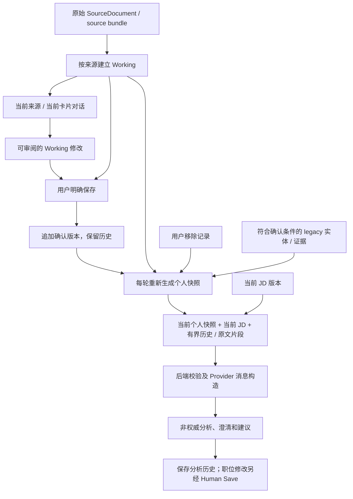

# 个人理解与 Candidate × Job 架构审计

日期：2026-09-09。范围：个人材料导入与上下文、跨材料聚合、Candidate/JD 对话实际输入、保存与版本、资料移除、长期使用边界。基于本仓库实现、63 个自动回归及隔离浏览器合成数据检查；不是对所有代码路径的无缺陷保证。

## 结论

**JD 对话已有跨资料的个人上下文；个人区尚未形成统一的、持续校准的“对这个人的理解”。** 当前能做到“用户补充并保存资料后，后续 JD 使用更新内容”，不能验收为“聊得越多就持续记住并更了解使用者”，更不能声称完全理解一个人。

开发所用模型的能力不能弥补应用没有传入的资料、没有持久化的事实或没有实现的反馈路径。本次未改变应用 Provider/model。

## 实际数据流

这里没有 `JD 新信息 → Candidate 待确认提案 → 用户保存` 的已实现箭头，也没有跨来源的长期个人模型。不能通过让普通讨论直接修改确认资料来补上缺口。

## 从实现证明上下文范围

| 路径 | 当前实际行为 | 依据 |
| --- | --- | --- |
| 个人材料导入 | 同一次来源 / bundle 内建立 Working；跨来源综合不是持久化的统一个人模型 | [candidate-model-runtime-domain.js](../../public/candidate-model-runtime-domain.js)：`proposalsFor`、`dedupeItems`、`requestFor` |
| 个人列表工作区对话 | 读取 session 的 `source_document_id` 对应最新 Working；不是读取全部个人资料 | [candidate-workspace-conversation-runtime.js](../../public/candidate-workspace-conversation-runtime.js)：`executeListTurn`、`latestWorkingModel` |
| 个人卡片详情对话 | ITEM/ITEM_DRAFT 只把当前卡片完整语义传给 Provider；后端 `other_item_directory` 为空。前端目录不等于实际入模内容 | [candidate-conversation-context-compiler.js](../../public/candidate-conversation-context-compiler.js)：`compileCandidateData`；[candidate_conversation_runtime.py](../../src/candidate_conversation_runtime.py)：`_provider_candidate_context` |
| JD 个人快照 | 读取 7 个 store；按 context 选最新确认版本、按 source 选最新未被整体接受的 Working，加符合确认条件的 legacy 实体 / 证据；Confirmed/Working 分层标识 | [job-candidate-context-domain.js](../../public/job-candidate-context-domain.js)：`confirmedRecords`、`workingRecords`、`buildSnapshotFromDatabase` |
| JD 真实请求构造 | 每次发送重建快照，与当前 JD、变化记录及原文片段编译；后端将其放入 `messages` 的 `active_context` | [v1-pages.js](../../public/v1-pages.js)：`submitJobConversation`；[job-conversation-domain.js](../../public/job-conversation-domain.js)：`compileContext`；[job_conversation_runtime.py](../../src/job_conversation_runtime.py)：`build_job_conversation_payload` |
| 更新与并发 | 保存追加确认版本；JD 再次发送会读新版本；模型返回后重读 Candidate/JD 并核对 observation，变化时标记 stale | 上述 `submitJobConversation`；[local-candidate-review-domain.js](../../public/local-candidate-review-domain.js)：`persistUserEdit`；[truth-persistence-domain.js](../../public/truth-persistence-domain.js)：`persistWorkspaceAcceptance` |
| 长期记忆 | Candidate 编译的 `summary` 固定为空；Candidate 与 Job 都只取有界历史（最多 8 轮，Candidate ITEM 还有版本/focus 过滤）。保存了历史不等于下一轮能看到全部历史 | Candidate compiler 的 `completeHistory`、`compileContext`；Job domain 的 `connectedHistory`、`compileContext` |
| JD 回写个人理解 | Job 输出的 `j2_hooks.candidate_update_proposal_intent` 固定为 null，分析保存为 `NON_AUTHORITATIVE_JOB_ANALYSIS`，没有 Candidate 保存路径 | Job domain 的 `validateSemanticOutput`；[job-conversation-persistence-domain.js](../../public/job-conversation-persistence-domain.js)：`createAnalysis`、`persistSuccessfulTurn` |

快照传入的是资料的结构化语义，并非每次把所有原始 PDF/图片重新交给模型。原文检索由 `retrieveJobTurnSources` 与 [source-retrieval-domain.js](../../public/source-retrieval-domain.js) 控制，依赖明确来源需求 / 提示和有限的词项匹配；最多 12 段、单段 1,200 字符、合计 6,000 字符。它不能证明所有原始细节都能被按需找回。

## 本次修复

### 1. 已移除卡片通过 Working 重新进入 JD（P1，已修复）

触发：某张已确认卡片也存在于尚未整体接受的 Working 中；用户选择“仅删除这张卡片”。个人列表过滤 lifecycle，旧 JD 聚合器只在 Confirmed 层过滤，Working 层仍包含已移除内容。

修复：通过确认版本保留的 context、source、item 身份，将有效移除记录应用到 Working。不同来源即使 item ID 相同也保持独立；不做标题匹配。同步要求 lifecycle 的 authority 为 `AUTHORITATIVE_USER_DECISION`，与个人列表一致，非权威记录不能隐藏确认资料。

### 2. 用户移除全部资料后，被误判为接线故障（P2，已修复）

旧逻辑以“历史 store 有记录，但当前快照为空”判定 `CANDIDATE_CONTEXT_WIRING_EMPTY`。保留历史的正常移除会触发此错误，只有未确认 legacy 条目时也可能误报。

修复：只计算符合上下文条件的记录；区分有效移除导致的空结果与本来无法产生有效上下文的异常记录。允许合法空资料，保留畸形有效记录的 fail-closed 检查。`candidate_snapshot_present=true` 表示读取/编译已执行，不表示一定有个人事实；数量字段可为 0。

原始来源、确认历史和 Working 历史均未被快照编译修改。此处“移除”是退出当前使用范围，不是销毁文件；历史分析仍可能保留当时内容，变化记录可明确引用已移除内容作为历史。

## 尚未补齐的能力与风险

| 优先级 | 问题 | 对“越用越了解”的影响 |
| --- | --- | --- |
| P1 产品缺口 | 没有跨来源的个人理解入口，个人详情仍是当前卡片范围 | 不能在简历卡片里假定 AI 知道另一份作品集；JD 的一次性聚合也不等于统一个人模型 |
| P1 产品缺口 | 没有从对话提炼新事实、偏好、目标、矛盾并形成待确认记忆的闭环 | JD 中补充的个人事实不会自动供别的 JD 使用；超出有界历史后也不能依靠模型继续记住 |
| P1 扩展边界 | JD 全量结构化快照随资料累积，序列化超过 128,000 个 JS 字符单位直接失败；没有经过验收的长资料压缩 / 语义检索机制 | 材料增多可能最终无法分析。不能把增加上下文上限当作完整修复 |
| P2 语义风险 | 不同 source 的同一经历、Confirmed 与未整体接受的 Working 可能同时入模；没有跨来源统一身份与冲突裁决层 | 模型必须处理重复和矛盾，代码尚不能保证不会把重复记录当成独立支持。不能无依据合并同名经历 |
| P2 既有界面问题 | 个人直接编辑预览仅显示“标题 + 事实数量”；只改摘要时前后预览相同（`v1-pages.js` 的 `preview-direct-edit`） | 浏览器合成编辑已复现；保存的数据本身正确，但确认前无法从该预览看清语义变化。本次未修改这条界面路径 |

以上与当前契约一致的能力缺口没有被伪装成 bug 修复完成；当前未启动 J2、新 Provider、自动投递或通用 Agent 平台。

## 验证记录

- 修复前：41 Node + 22 Python = **63/63** 默认自动回归通过；说明原有用例遗漏了上述组合边界。
- 新增回归先失败于 `removed Candidate leaked to JD as Working`；修复后覆盖：同源已移除 Working 排除、同源其他卡片保留、跨源同 ID 保留、非权威移除不生效、全部移除的合法空快照、未确认 legacy 不误报、畸形有效记录仍失败、输入历史不变。
- 修复后：同样 **63/63** 默认自动回归通过，包含新增断言；未执行可选私人 fixture 或真实 Provider 质量测试。
- egolite 独立 `127.0.0.1:8019` 合成数据，使用生产页面事件、IndexedDB、快照编译、后端请求校验与 Provider payload 构造。4 轮出站候选数量分别为 `Confirmed/Working = 2/2 → 2/2 → 1/1 → 0/0`。
- 第二轮确认人工作出的摘要修正（12 次访谈改为 18 次）已经进入实际 Provider payload，旧值退出当前快照。第三轮移除一张卡片后，该卡片从两层同时退出；第四轮全部移除后仍通过后端输入校验。
- 测试服务器在构造 Provider payload 后返回指定 503，外部调用 **0**；页面明确报失败、发送按钮恢复。最终保留 3 个来源元数据、3 个 Candidate 确认历史、3 个 Working 历史、2 个移除决定、3 个 Job 确认历史；新增 4 条失败执行记录，无分析或伪造助手回复。来源 Blob 恢复由既有自动回归覆盖，本次浏览器 fixture 没有冒充真实文件验收。
- egolite `Page.captureScreenshot` 技术超时；本次交互证据为 DOM/状态、持久化读回与后端 payload，不声称完成布局/截图验收。
- 日志、合成 fixture、浏览器最终状态和逐轮 payload 保留在忽略目录 `.cache/personal-understanding-audit-20260909/`，不提交运行数据；未写旧 Learning OS 目录、未 push。

## 下一阶段应采用的行为契约

要达到可验证的“持续了解使用者”，建议下一阶段先完成**共享的只读个人上下文与可审阅的记忆提案**，保持修改权限按领域隔离：

1. 个人区提供明确的全资料理解入口。资料详情可引用跨资料的只读背景，但修改目标仍限制为当前卡片；不能因为可读而获得全局写权限。
2. 为跨来源关联、冲突与未知保存有版本的派生理解，注明来源和依据；原始陈述、用户确认、模型推断分开。陈旧、被移除的信息不能重新成为当前事实。
3. Candidate/JD 对话中的新信息先形成可审阅提案。用户选择保存后才更新个人确认版本；用户偏好与目标单独区分“当前讨论”与“已确认长期选择”。
4. 采用可检查覆盖范围的有界上下文策略，报告未纳入的资料和过期理解，保留可追溯回原文的路径。不能把任意摘要当作原文完整替代。
5. 用端到端场景验收：跨两份材料解释关联；指出相互矛盾的日期/角色而不自行裁决；保存纠正后在另一 JD 和刷新后生效；拒绝/未保存不晋升；移除失效；历史超过 8 轮、资料超过当前上限仍有可解释行为。真实模型语义质量需另有真实执行证据，结构测试不能替代。

本阶段完成的是审计和个人快照一致性修复；“持续理解闭环”仍是未完成的产品目标。
