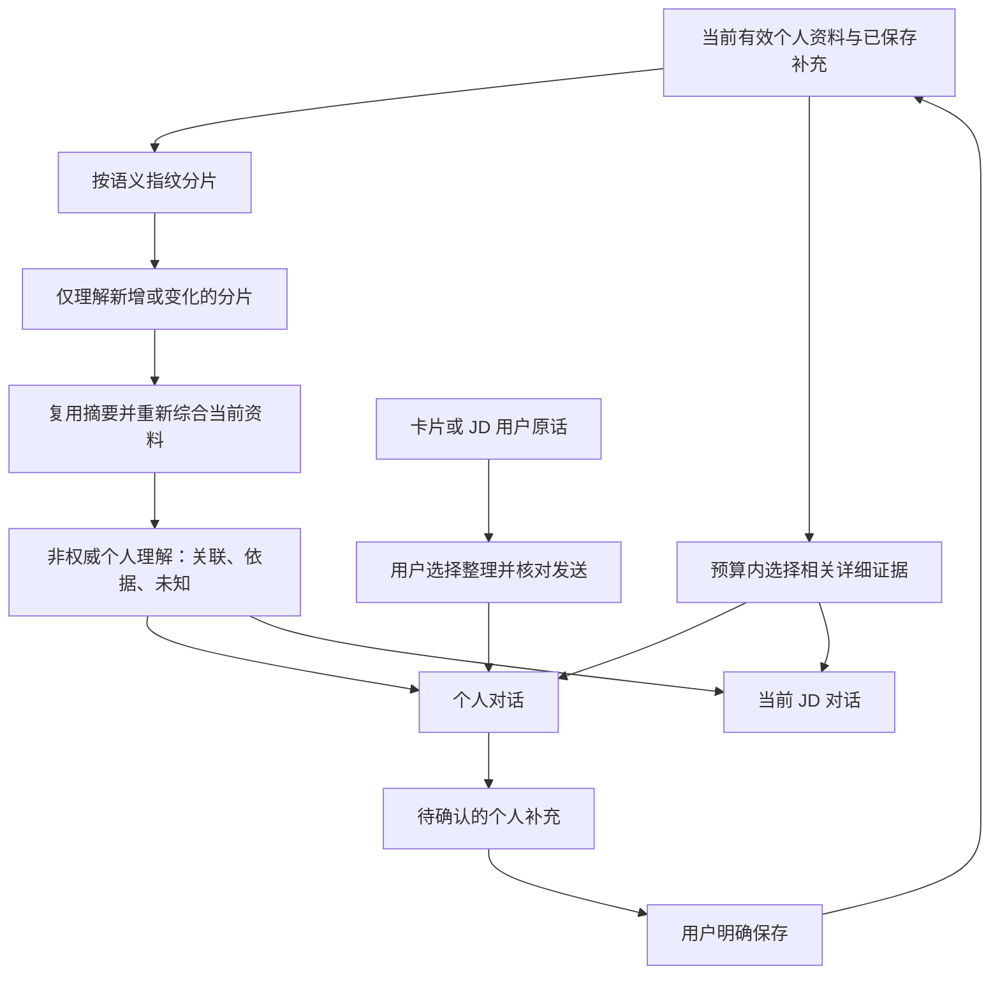

# 持续个人理解 v1：实现与验收

日期：2026-09-09。依据用户授权实施：跨资料理解、可审阅的个人记忆、有界上下文，并评估完整对话入口。本文描述本阶段实现；此前 [架构审计](ARIADNE_PERSONAL_UNDERSTANDING_AUDIT.md) 保留为历史基线。

## 产品结果与入口

个人资料页新增「个人理解」入口，进入 `personal-understanding.html`。页面并列呈现当前理解、依据、未知、已保存补充及综合对话；它属于个人资料区，负责跨材料讨论。原卡片详情仍负责当前材料，JD 对话仍负责当前职位，不扩展它们的写入权限。

Candidate 来源工作区、卡片详情和 JD 对话中的用户消息新增「整理为个人补充」。点击只在本地保留原话和出处，再打开个人理解页供用户核对、发送；不会立刻调用模型或把原对话变成个人事实。网址仅携带草稿 ID，不携带原话。模型不能将自己的建议、职位要求或假设自动确认为个人经历。

无需另建通用聊天首页。此页面补齐跨资料对话的明确用途，同时让用户看见「当前知道什么、依据是什么、还有什么不确定、哪些补充已保存」。

## 数据与权限

- 原始 `SourceDocument`、Candidate/Job 确认版本、Working 和历史原地保留。数据库由 15 增量升级到 16；所有既有 opener 使用相同版本和 store 名称，没有删除 store 或重建个人数据。
- 新增六个 store：`personal_memory_revisions`、`personal_memory_proposals`、`personal_memory_decisions`、`personal_understanding_fragments`、`personal_understanding_snapshots`、`personal_conversation_turns`。
- 个人补充分为 FACT、PREFERENCE、GOAL、CORRECTION。模型仅提出 ADD/REPLACE/RETRACT Proposal；必须引用当前用户消息中的原话，关联引用必须来自本轮证据。用户可编辑、保存或暂不采纳。
- Human Save 在一个 IndexedDB transaction 内检查提案是否已处理、目标记忆版本、关联来源身份/语义/版本，并追加记忆 revision 和 decision。旧版本不覆盖；重复保存、并发覆盖和已变化的来源绑定均被拒绝。文本修正保留既有来源绑定。
- 「不再使用」经用户再次确认后追加 RETRACTED 版本；历史仍可查看，后续当前快照排除。相关来源移除或版本改变时，绑定的补充暂不使用，不能把旧修正套到新资料上。
- 用户确认是用户自述的权威，不等于外部事实核验。偏好和目标不会成为能力证据。个人记忆不是 Candidate 原卡片的静默修改，也不推进 Job 版本。

## 个人理解与上下文

实现入口：[个人理解领域](../../public/personal-understanding-domain.js)、[记忆事务](../../public/personal-memory-domain.js)、[上下文选择](../../public/personal-context-domain.js)、[共享 Candidate 快照](../../public/job-candidate-context-domain.js)、[Job 编译](../../public/job-conversation-domain.js)、[后端契约](../../src/personal_understanding_runtime.py)。

- 原资料结构化语义完整拆成最多 6,000 UTF-8 bytes 的分片，Unicode 字符不拆断。分片键包含来源身份、语义指纹、片段位置和 prompt 版本。模型必须为每个输入片段返回摘要，不能漏项后声称完整。
- 当前片段摘要全部参加分批综合；跨批沿用的只是本次遍历的部分综合结果。最终理解绑定当前完整快照指纹和 prompt 版本。资料变化或提示版本更新后，旧理解不再用于当前请求；历史仍保留。
- 相同资料重复更新理解为零 Provider 调用。只增加一条短资料时，复用旧分片摘要，理解新片段后重新综合。综合遍历仍随资料数量增长，不声称更新成本恒定。
- 个人讨论编译上下文上限 48,000 bytes；详细证据初始预算 18,000 bytes，可缩小，保留最多四轮且合计 4,000 bytes 的有效历史。仅复用与当前资料指纹一致的历史，旧版本推理仍显示但不重新入模。
- JD 的详细个人证据预算 24,000 bytes，近期历史 8,000 bytes，变更信息 8,000 bytes；保留既有总请求上限、JD 结构与来源片段边界。完整来源身份/版本 manifest 用于本地与后端观察校验，不作为模型消息全量正文。
- 选择策略是词项相关性、来源多样性与已确认记忆优先的本地检索规则，**不是语义向量检索或 AI 理解**。超长详细条目节选；总数、纳入数、遗漏数、节选数和预算随请求发送。个人页展示最近一轮覆盖和用量。
- 修正记忆与关联材料一起选择。资料达到预算时可能有记忆或材料未入选；模型必须承认覆盖范围，不能声称穷尽所有经历。
- 快照另包含记忆版本标记：即使新增后又停止使用、有效资料集合恢复原状，也不会重新启用保存前的旧聊天或旧理解。标记只用于版本判断，不增加 Provider 正文。
- 有个人记忆后，JD 历史只复用已绑定当前 Candidate 指纹的成功轮次；旧历史保留在界面。涉及旧记忆的变更正文不会通过 delta 回流。停止使用不是物理删除，也不抹除用户主动再次输入的信息。

## 模型与失败行为

复用现有 capability authority 和已验证多模态模型 `deepseek-v4-flash-vision-exp`，未修改用户选择或增加 Provider。新 operation 为 `PERSONAL_UNDERSTANDING_TURN`，分 DISTILL、SYNTHESIZE、DISCUSS 三种阶段；[共享契约](../../data/personal_understanding_contract_v1.json) 与后端签名需一致。

用户勾选当前 Provider/model 的资料传输与费用确认后才能执行；分批处理可能多次调用。Local 可查看和处理已有提案，但不提供伪造模型对话。Model 不可用、传输失败、截断、字段过长、漏摘要、未知引用或提案原话不符时明确失败，无 Local 回退、无确认写入。模型结果先通过结构/引用校验，结构通过仍不等于语义正确。

## 验证证据

- 独立验收树（`ff2e114` + 本阶段文件）42 Node + 23 Python = **65/65** suite 通过；既有 legacy analysis_review 需要本地数据库 fixture，使用原库只读备份完成。共享工作区同时进行 VI/图标修改，整区两项未完成图标断言失败不属于本阶段；相关文件原地保留、未纳入提交。
- 自动回归：新增个人理解领域及后端两项 suite，覆盖增量缓存、来源/prompt 失效、明确保存、拒绝、重复保存、版本冲突、关联来源变化、保留修正绑定、停止使用、旧历史不回流、Local/Model/费用边界、模型输出引用和长度、90 条超长资料预算、Unicode 无损拆分。
- 浏览器使用独立 `127.0.0.1:8020` origin 和合成人物/项目，未将真实私人材料提交 Provider。v15 预置数据库经页面升级到 v16 后，合成原始 Blob 内容逐字不变；原 Candidate/Job 历史保留。
- 真实模型识别简历与作品集对 Lyra 项目部署责任的冲突。普通对话仅生成待确认偏好；保存后刷新可见。偏好替换产生 v2，「不再使用」产生 v3，旧版本保留且退出当前快照。再次补充偏好和职责修正，经 UI 保存后进入另一 JD 请求。
- JD 真实请求同时带两份资料及两条已保存记忆，采用用户的部署责任修正，区分协作偏好与能力证据。Job 用户消息可经「整理为个人补充」进入有原话的本地草稿，未立即升格为事实。
- 真实更新理解复用两段资料摘要、只新增理解两段个人补充；再次点击更新理解 Provider 调用为零。个人理解明确以本人更正校准原材料，并保留来源冲突。
- 首轮真实综合出现 `PERSONAL_TEXT_INVALID`，无替代回答或确认写入；后续加入 schema 文本/数组长度约束、禁止空占位及正文机器引用，并加强来源归属、空字段和职责推断规则。历史失败与后续成功产物均保留，不宣称模型永不误解。
- 1280 px 与 390 px 页面可读，无横向溢出；窄屏提供直接跳转对话的入口。滚动后的 screenshot helper 空白产物保留，用同一 egolite 的 CDP viewport 截图复验对话与输入框；事件记录未发现错误。保存/停止使用/拒绝和历史展开通过 UI 验证。新位置 :8000 已重启并核对 7 个静态文件及后端签名。
- 证据位置：忽略目录 `.cache/personal-understanding-implementation-20260909/`，包含回归日志、合成请求/响应和 egolite 截图；不提交运行数据。

## 当前限制与后续方向

这完成了「补充 → 审阅保存 → 持久化 → 下轮个人/JD 使用」及「资料变化 → 更新当前理解」的第一版闭环。它让项目能持续积累对用户的可校准理解，仍依赖底层模型，不是替代模型本身。

1. 尚无跨设备账号/同步；浏览器 origin/profile 变化、用户清除网站数据会影响本地记录。未增加备份导出功能。
2. 摘要有损、词项检索可能漏掉语义相关材料，超长材料真实模型与长期多月使用质量尚未验收。不能保证完全理解每份原文或整个人。
3. 新资料的分片摘要可增量复用，但全局综合仍需遍历当前摘要；下一步可在实际规模证据下设计层级摘要和可评估的语义检索。
4. 同名经历不会自动合并，也没有跨来源实体的人工归并界面；矛盾可呈现、可用有来源的修正补充校准，不能自动裁决所有冲突。
5. 资料卡片详情保持当前卡片范围。需要跨材料讨论时进入个人理解；未在卡片旁悄悄扩大全局修改权限。此前审计列出的卡片直接编辑摘要预览问题不属于本阶段改动。
6. 没有新增自动投递、自动简历改写、进度管理平台或通用 Agent 工具执行。完整职业行动/反馈闭环仍需独立定义和验收。
