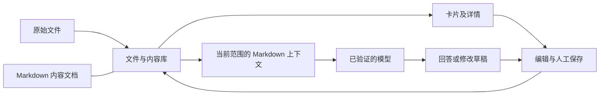

# Markdown 内容库与卡片存储

更新：2026-09-13。替代此前“IndexedDB 领域正文是唯一权威、Markdown 尚待迁移”的实现状态。用户要求保留现有功能，Local 只存原件；本次完成主存储和模型上下文接线，按浏览器工作区首次访问自动迁移。此前 egolite 和本次实际报错的 Codex 内置浏览器工作区已分别切换；这不表示其他浏览器 profile/origin 均已迁移。

## 当前结构

| 职责 | 实现入口 | 边界 |
| --- | --- | --- |
| 文件与内容库 | [共享存储契约](../../data/workspace_storage_v1.json)、[内容库入口](../../public/content-database.js)、[本机文件库](../../src/workspace_storage.py) | 原件、正文、身份、完整性、事务及历史 |
| 卡片与编辑 | 现有领域 repository、[共用页面](../../public/v1-pages.js)、ProductShell | 解码当前文档，展示和修改同一份内容 |
| 本轮上下文 | 现有 Candidate/Job/个人理解/概况 compiler、[Markdown renderer](../../src/markdown_context.py) | 当前范围、版本、引用、覆盖和预算 |
| 模型执行 | 现有 Runtime capability、各领域 adapter、Codex/其他 Provider transport | 原资格、传输确认、协议及结构化输出校验 |
| 修改保存 | Truth、个人补充、Job edit 等既有领域 action | Working/Proposal 可审阅；Human Save 才产生确认版本 |



仍是原生网页 + 一个 Python 服务，没有新增部署服务、框架、向量数据库或通用 Agent。共享事务接口兼容当前 repository 的 get/getAll/add/put/delete/clear、回调及 abort；它不是完整 IndexedDB 实现，不支持 cursor/index/key range。新功能应复用现有 repository，不能假设任意 IndexedDB API 可用。

## 一份正文，两种存储适配

正常本机访问 `127.0.0.1` 或 `localhost` 时，内容写入实际磁盘；其他 origin 使用[浏览器适配器](../../public/content-browser-storage.js)，正文仍为相同 Markdown 格式，原件仍为 Blob/File。浏览器端无需假设文件系统权限。连接本地 Codex 不会同时授权网页访问本机内容目录。

本机默认目录为 `data/workspaces/<workspace-id>/`，可在启动时用 `ARIADNE_WORKSPACE_ROOT` 指定整个库的位置：

```text
data/workspaces/<workspace-id>/
  HEAD.json                         当前索引：身份、路径、hash
  documents/<store>/<hash>.md       当前和历史语义文档
  originals/<hash>/<original-name> 原始字节，保留文件名元数据
  state/<database>/<store>/*.json   来源索引、会话、运行、投递等状态
  history/*.json                   历次完整索引
```

没有文件名的 Blob 使用 hash 文件名。导入时提供的文件名始终保留在来源记录，磁盘名称仅做路径安全处理；ID/hash 决定身份，不靠标题匹配。原有 `indexeddb://...` source URI 继续作为逻辑来源身份，由共享 repository 解析，不代表仍从旧数据库读取。

当前契约注册三组既有逻辑库（主库 51 类记录、投递记录、逐轮附件）。其中 32 类含语义的历史及当前记录由[无损 codec](../../public/content-document.js)保存为 Markdown；机器状态保持 JSON。这些名称继续用于限定读取和领域保存，不是 53 个服务或 53 套同步系统。

首页统计与个人/JD 卡片复用同一组集合读取函数，沿用当前确认版本、生命周期及历史兼容规则，不再单独统计演示记录。存储层共用错误文案；页面区分正在读取、确实为空和读取失败，不把存储失败转成“尚未添加”或普通整理失败。

Markdown 元数据保留稳定 ID、版本、来源及确认状态；正文字符串只存于可读区块，骨架不再持有第二份正文。新增自由文本字段、卡片未显示段落、原始空白、数组顺序和未知都可无损往返。卡片使用内存中的结构化投影，写回时重新编码该版本，不另建可独立编辑的 JSON 正文。

文件名采用内容 hash，以保留不可变历史和相同内容复用。因此目前不是用户手工命名的“经历.md”文件夹，也没有新增独立 Markdown 编辑器或全文文件夹同步功能。可直接读取或复制这些 `.md`；修改活动文件会触发 hash 冲突，不能静默变成已确认资料。任意外部 Markdown 当前可按原件归档；自动识别它的领域差异并生成结构化审阅稿尚未实现，不能将普通上传当成完整外部编辑回写器。

## 迁移及恢复

1. 每个浏览器 origin 的 `localStorage["ariadne-content-workspace-v1"]` 保存随机工作区 ID。首次访问某个逻辑库时，读取同 origin 的旧 IndexedDB。
2. 在一次只读事务中取得旧快照，按契约验证记录可往返；原件逐份写入不可变文件，不把全部原件堆进一个事务请求。
3. 验证文件 hash、记录往返及目标初始版本，完整索引一次原子提交。全部成功才激活；失败不显示保存成功，旧记录和原件仍保留，可重试。未激活的临时文件保留作诊断。
4. 后续所有已接入页面仅写新内容库。旧数据库原地保留为迁移时备份，不双写、不删除；迁移时间和逐类数量留在该 origin 的 localStorage 迁移回执。
5. 浏览器适配器使用 `ariadne-markdown::<旧库名>` 保存 Markdown，`__workspace` 标记与复制内容在同一次原生事务提交；旧数据库同样保留。

本机存储入口兼容历史 SHA-256 的两种表示：64 位十六进制和 `sha256:` 加 64 位十六进制。仅在与原件 bytes 比较时统一表示，旧记录里的 hash、来源 ID、字段及原件保持原样；不同摘要、格式错误或其他算法仍拒绝提交，完整索引不会部分激活。历史学习记录不会因此升级为正式 SourceDocument，领域原有校验仍独立执行。

2026-09-13 实际故障来自旧来源的裸摘要与新入口的带前缀摘要直接字符串比较，摘要本身相同。前次验收使用另一 browser profile，未覆盖这四份学习时期原件。修复集中在共用存储入口及错误呈现，没有给两个领域分别增加迁移器或绕过校验；服务端只记录错误码、操作和已注册逻辑库，避免记录来源正文和身份。

首次切换应刷新或关闭仍运行旧版本脚本的页面。旧数据库是切换时快照，之后不能当作最新内容继续编辑。修改 host、端口、profile 或清空 localStorage 不会自动关联已有磁盘工作区，也不会删除原文件；恢复时应先核对原 origin、迁移回执、工作区 ID 和 HEAD，再恢复对应映射，不能按文件名自动合并陌生资料。当前没有账号同步或跨 origin 自动迁移。

完整备份应保留工作区目录（包含 HEAD、documents、originals、state、history）及其 origin/工作区 ID 映射；不能只复制几个当前 Markdown 就声称备份了原件、会话和所有功能。恢复旧索引需要停下写入、核对其引用文件完整性，再进行明确的恢复操作；本次不自动回滚用户资料。

## 保存与规模边界

- Web Locks 串行协调同工作区页面；本机文件锁及 read-set 版本校验防止并发覆盖。不同客户端读到旧版本时明确冲突。
- 文件先经临时写入、fsync 和原子替换，再提交 HEAD。写入中断不会让部分原件占据最终 hash 路径；重试无需删除原件。丢失提交响应可用同一事务 ID 重试，回执防止重复保存。
- 列表只读来源元数据；选中原件才传输原始字节。文件hash在恢复/引用时校验；磁盘外部改动或缺失明确报错，不切回旧库或 Local 假成功。
- 删除/撤回只改变当前领域状态或索引；历史文档、原始字节和旧索引仍保留。
- 沿用既有单文件及模型输入预算；本机单次 JSON 请求上限为 256 MiB。原件分开上传消除了“整个库所有文件必须放入一个请求”的限制；元数据迁移仍是一次完整索引提交，未做百万记录规模或断电硬件测试。
- 不承诺全文检索索引、云端同步、自动清理历史或任意外部编辑回写。缺磁盘空间、损坏文件、版本冲突不会变成空记录或假回复。

## 模型实际读取什么

Candidate 对话、Job 对话、个人理解和职位概况复用同一 renderer，将已校验、按当前范围选出的文档投影编译成 Markdown。字符串精确保留，引用 ID 不改；权限、当前用户消息及输出 action 仍由原领域契约约束。上下文是每轮内存投影，不再永久保存另一套正文。

模型不直接遍历本机文件夹，也不会把所有 Markdown 每次全读一遍。预算内完整读取当前范围；超预算沿用已有覆盖说明和分片/综合机制。导入及视觉核对继续使用原始图片、完整逐页 PDF 和必要技术准备。模型返回有类型的回答/修改，代码校验，用户保存；Markdown 不替代来源证据或保存权限。

## 验证及已知限制

- 96 套离线回归通过：61 Node + 35 Python，包括三个新增的 codec、真实 HTTP/磁盘及原子持久化回归。旧 Local 学习契约继续通过，正常导入保持零本地识别。
- 五组实际浏览器 QA：旧内容/原件迁移与卡片保存、浏览器内 Markdown 适配、原件归档、投递记录、附件与四个历史页面。覆盖失败/重试、逐项往返、版本历史、未知保留、跨页冲突、取消、原件字节、传输确认、刷新和桌面/390 px；无页面异常。模拟模型失败明确标记为测试替身。
- 真实 Codex 使用既有 `codex / gpt-5.6-sol`：六条领域执行 + Candidate/Job 明确修改草稿均通过。Candidate PDF 的两页全部转图并传输，结果分别引用两页；Job 保留原文未提供的摘要为未知。两域修改分别返回 `PATCH_ITEM` / `PROPOSE_JOB_EDIT`，未写确认版本。
- 职位修改首轮测试错误地保留了 fixture 的 `job_edit_requested=false`，模型回复声称已生成草稿，但实际输出没有草稿；该轮只视为执行完成，不能算修改验收。修正为真实页面同等授权范围后重测，实际返回地点修改对象；保留两轮证据。不由这些有限合成样本推断所有真实材料或所有模型质量。
- 发现并修复原有 Local 编辑已确认 Candidate 缺 Working 依赖、Job 保存清空既有 unknowns 的问题；两个页面失败时保留待保存编辑并显示错误。
- egolite 实际交互通过，截图 API `Page.captureScreenshot` 超时；独立 Chrome 测试补充截图并检查桌面/390 px。VI 静态与负向检查通过。
- 2026-09-12 egolite profile 的 `http://127.0.0.1:8000` 既有主库 371 条、投递 2 条、附件 3 条已实际迁移。迁移前数量清单、回执及逐条比较结果保留；所有字段、原件 SHA-256、File 名称/类型/时间均一致，旧数据库不变。该范围不包括次日报错的内置浏览器 profile。
- 2026-09-13 Codex 内置浏览器原报错工作区主库 1,854 条已迁移并通过所有引用文件的磁盘完整性读取，114 条来源记录中的 57 份带摘要原件（4 份裸摘要、53 份带前缀）逐份一致；个人 36 张卡片、职位 17 张，首页数量一致且无错误。投递库为空且已初始化，附件库尚未访问，未推断其已迁移；未替换工作区映射或将这些资料发给模型。
- 本次补充旧裸摘要/新正式来源混合迁移、未知字段与 File 属性无损、真实不同摘要拒绝且不激活、三页面显示具体错误、失败后重试、确认版本保存和首页统计回归。证据位于 `.cache/storage-recovery-20260913/`；与前次真实模型验证分开，本次未发起真实模型调用。
- 证据原地留在 `.cache/markdown-migration-20260912/`，最终浏览器在 `final/`、真实模型在 `live-codex/`。模型和隔离 QA 使用合成数据；本机既有内容迁移证据为 `main-origin-before.json`、`main-origin-migration.json`、`main-origin-verified.json`，不包含材料正文。公开 HTTPS 配对/托管发布本次未重复验收。
