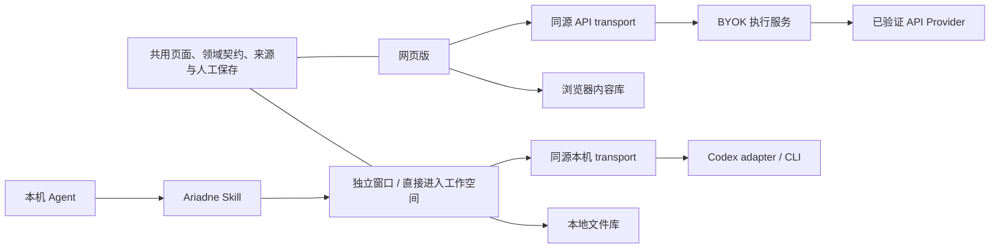

# Ariadne：Web 与 Skill 双端架构

2026-09-20 用户确认：网页版使用 API，本地 Agent 通过 Skill 使用；本地直接进入工作空间，不需要模型选择首页。反馈更新、其他 Agent adapter 与跨端资料同步不属于本阶段。

| 职责 | Web | Skill |
| --- | --- | --- |
| 入口 | 连接自己的 API，或暂不连接 AI 管理原件 | 独立窗口直接进入工作空间 |
| AI | 同源 BYOK 服务 → 已验证 API Provider | 本机服务 → 已验证 Codex CLI adapter |
| 存储 | 当前 origin 的浏览器 Markdown 内容库 | 固定目录下的工作区文件库 |
| 连接管理 | 添加/验证自己的 API Key | 启动时检查本机 Codex、登录与 PDF 工具 |
| 网页本地 Agent 入口 | 仅安装/使用说明，无配对、端口探测或本机调用 | 从 Agent 调用 Skill 打开独立窗口 |
| 退出 | 关闭网页，资料保留 | 关闭最后窗口，停止专属服务，资料保留 |

## 组合层与共用层

- `public/product-config.js` 是静态 Web 的产品契约；Skill 服务同路径生成 `kind=skill/storage=filesystem/runtime=codex`，在页面业务脚本之前加载。产品身份不由 hostname、旧 API 偏好或旧配对 token 决定。
- `public/product-shell.js` 提供产品级有效 Runtime 和导航；Skill 不写掉历史 Web/API 偏好。共用选择解析器在 Skill 下从固定 Agent runtime 开始，保留相容的对话推理强度设置；能力验证和每次派发的 RuntimeSnapshot 仍由原契约负责。
- `public/product-transport.js` 只发送同源请求。Web 的 API Key 与临时会话只进入对应同源 BYOK 路由；Skill 请求不携带旧 API Key 或配对 token。Web 拒绝 Codex、Skill 拒绝 API Provider，旧配对状态不再参与路由。
- `src/product_application.py` 组合 Skill HTTP 入口：根地址/旧首页转到工作空间，模型目录仅包含 Codex，API 连接设置被拒绝，模型业务请求必须绑定 Codex。Codex 不可用返回明确失败，不切换 Provider 或 Local 生成替代结果。
- `web_app.py` 与 Cloudflare Worker 继续负责 Web 的 origin、API Provider、凭据和请求隔离，禁止 Codex、磁盘工作区和任意本机路由。页面静态资源保持同一套。
- Candidate/Job 页面、上下文编译、来源定位、能力资格、Working/Proposal、Human Save、版本冲突与对话持久化为共用领域层。分产品不复制业务实现，也不改变普通讨论不能修改确认资料的边界。

## 数据与兼容

沿用 Skill 默认 origin `http://127.0.0.1:8766`、`~/Library/Application Support/Ariadne Skill` 与 `ariadne-content-workspace-v1` 身份映射；不改目录、不创建迁移副本、不按最近修改时间猜测工作区。Web 和 Skill 是两份独立数据，不承诺自动同步。换 Agent 时仍需相容 adapter、同一资料目录与明确工作区身份。

旧 `public/local-connector.js`、`public/codex-connect.js` 与后端配对实现源码保留为历史兼容研究材料，当前页面不加载，Skill CLI 的 `connect` 明确返回 `WEB_PAIRING_RETIRED`。旧 `/codex-connect.html` 仅显示安装说明；当前发布入口不运行配对服务。旧 App/资料/QA 证据原地保留。

启动本身不调用模型。材料发送继续使用原确认机制；服务关闭不等于撤销已发出的请求。当前固定沿用已验证的 `codex / gpt-5.6-sol`，不是继承唤起 Skill 的聊天模型或上下文。其他 Agent 未加入选择器。

## 验收与交付边界

边界回归覆盖：历史配对不转发、Web 在 loopback 仍按 Web 运行、两端 Provider 拒绝、API Key 隔离、旧偏好保留、Skill 首页跳转、缺依赖失败与资料重启保留。真实浏览器验证两端入口、安装说明、导航、窄屏与已有合成资料恢复。阶段实际结果见 `PROJECT_STATUS.md` 最新条目。

2026-09-20 已按用户要求发布至正式域名：Pages `a56a6d36`，API Worker `4ab1078e-7937-4687-a827-ddba54044bc5`，官网提供同版完整 Skill 包。线上桌面/手机引导、API 边界、安装指令与下载完整性已验证；本机 Skill 与真实 Codex 证据见前一阶段记录。本轮未重新执行真实模型，也未 push Git；其他 Agent 与其他电脑仍需各自验收。

2026-09-20 安装入口进一步合并到首页「通过本地 Agent 使用」窗口，直接复制指令；旧 install 地址回到 `/#skill`。完整 Skill 包在仓库 GitHub Releases 分发，网页同源包保持相同字节用于检查和兼容，安装指令绑定固定 tag 与 SHA-256。当前 Pages 为 `6062f6c7`，源码已同步 GitHub；此前未 push / 独立安装页记录为历史。
